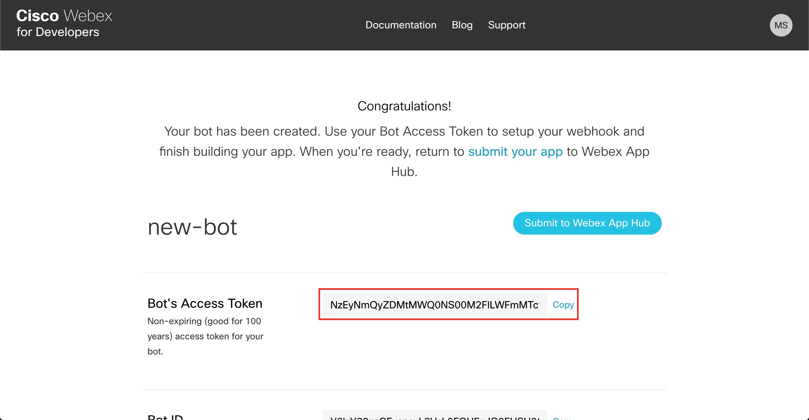
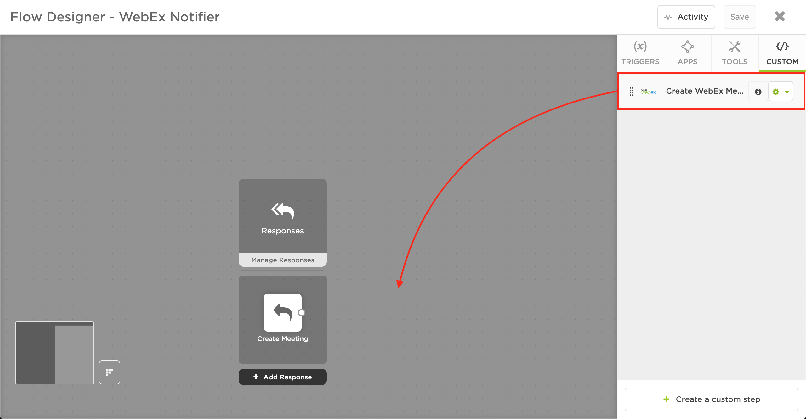
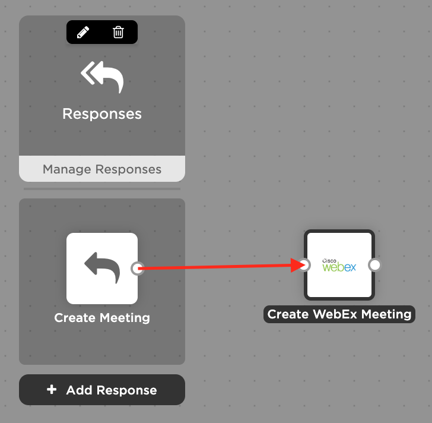
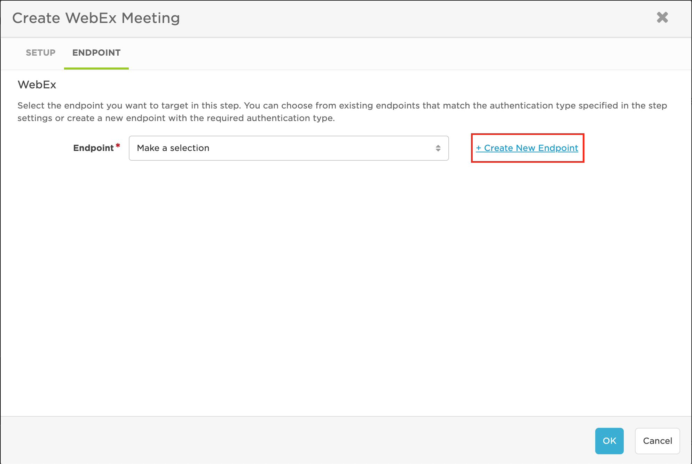

# WebEx Outbound (from xMatters) integration
This is part of the xMatters Labs Steps awesome listing. For others, see [here](https://github.com/xmatters/xMatters-Labs-Flow-Steps).

With this library, notification recipients can quickly create a meeting in WebEx and use the outputted meeting link to invite others to the meeting.

This document details how to install and use this integration. 

---------

<kbd>

</kbd>

---------
# Pre-Requisites
* xMatters account - If you don't have one, [get one](https://www.xmatters.com)! 
* An xMatters Communication Plan with a form already created
* WebEx account - If you don't have one, [get one](https://webex.com/)!

# Files
* [script.js](./script.js) - This is the script to paste into the custom step, which creates the room and gets the meeting url

# Introduction - How it works
WebEx is a meeting solution known for its on-demand collaboration, online meeting, web conferencing and videoconferencing applications. This integration with xMatters makes it easy to create and invite people to join a WebEx meeting from an xMatters notification, allowing anyone you give the link to join the meeting with just a click.

# Installation

## WebEx Setup
In order to create a WebEx meeting, you need to have a WebEx bot with an access token in order to authenticate to WebEx

1. Navigate to the [Create New Bot](https://developer.webex.com/my-apps/new/bot) page and log in with your WebEx account
2. Give your bot a name and username, select an icon (or upload one if you so desire), and write a brief description
3. Save your bot's access token somewhere you will be able to access it later (you won't be able to see it again)

## Create Room Step

### Settings

| Option | Value |
| --- | --- |
| Name | Create WebEx Meeting |
| Description | Creates a meeting in WebEx |
| Include Endpoint | **✓** |
| Icon | [WebEx Icon](./media/webex-icon.png) |
| Endpoint Type | No Authentication |
| Endpoint Label | WebEx |

### Inputs

| Name | Required Field | Minimum Length | Maximum Length | Help Text | Default Value | Multiline |
| ------- | ---------------- | -------------------- | -------------------- | ----------- | --------------- | --------- |
| Bot Access Token | **✓** | 0 | 2000 | Bot Access Token |  |  |
| title | **✓** | 0 | 2000 | Title of the WebEx room | You can add a default title here or leave it blank |  |
| id |  | 0 | 2000 | A unique identifier for the room |  |  |
| type |  | 0 | 2000 | Type of meeting room, either "direct" for 1:1, or "group" for more people | You can add a default room type here or leave it blank |  |
| isLocked |  | 0 | 10 | Whether or not to lock the room, either `true` or `false` | You can choose to put a default value here or leave it blank |  |
| teamId |  | 0 | 2000 | If isLocked is true, set the teamId to be the team you would like to lock the room to | You can choose to put a default team here or leave it blank |  | 

### Outputs

| Name |
| --- |
| roomId |
| meetingLink |
| meetingNumber |
| tollFreeNumber |
| tollNumber | 

### Script
In the script tab, paste in this [script](./script.js)

## Usage
1. In your flow, click and drag the custom **Create WebEx Meeting** action into the flow

2. Connect your WebEx **Create Meeting** response option (or any other step that you would like to fire a WebEx meeting from!) to your custom **Create WebEx meeting** action in the flow

3. Double click the **Create WebEx meeting** custom step
4. Fill in the input values in the **Setup** tab, for example

| Bot Access Token | title | id | type | isLocked | teamId |
| --- | --- | --- | --- | --- | --- |
| [Bot Access Token you copy from WebEx] | xMatters - New meeting |  |  |  | MY_TEAM_ID |

5. In the **Endpoint** tab, click **Create New Endpoint**

6. Fill in the endpoint with the following values, then click **Save Changes**

| Name | Base URL | Trust self-signed certficiates | Authentication Type |
| --- | --- | --- | --- |
| WebEx | https://api.ciscospark.com | | None |

7. Close out of the endpoint editor, then click OK to save the custom step, then click **Save** to save the flow

# Testing
To test the step, fire the xMatters outbound notifier and select the **Create WebEx Meeting** response option. If it works, the `meetingLink` will be populated with the WebEx meeting link.
* To see the meetingLink, edit the script for the custom step inside the Flow Designer, adding a line at the end with `console.log(output['meetingLink'])`
* Now, when the **Create WebEx Meeting** response fires, you should be able to see the meetingLink in the activity stream (access this by clicking on **Activity** inside the Flow Designer, then clicking on the WebEx step)

# Troubleshooting
If the step is not working properly, there are a few places where it could be going wrong.
## WebEx side
1. First, check to make sure you have the correct credentials. You should have saved your WebEx Bot's access token somewhere. If not, create a new one:
2. To do this, navigate to your WebEx bot page (find it from [here](https://developer.webex.com/my-apps/), log in with your account, then click on your bot
3. Click on **Regenerate Access Token**, then make sure to save it and set your access token inside xMatters to this value

## xMatters side
1. Once you've made sure that your Bot Access Token matches that in WebEx, check that you defined all the inputs and outputs correctly
2. If you have defined everything correctly, make sure you are using the outputs in the way you want to (for example—inside a Slack message)
3. If all of these are correctly defined, check the log for the Flow (by clicking on **Activity** inside the Flow Designer and selecting the WebEx step) for more guidance
